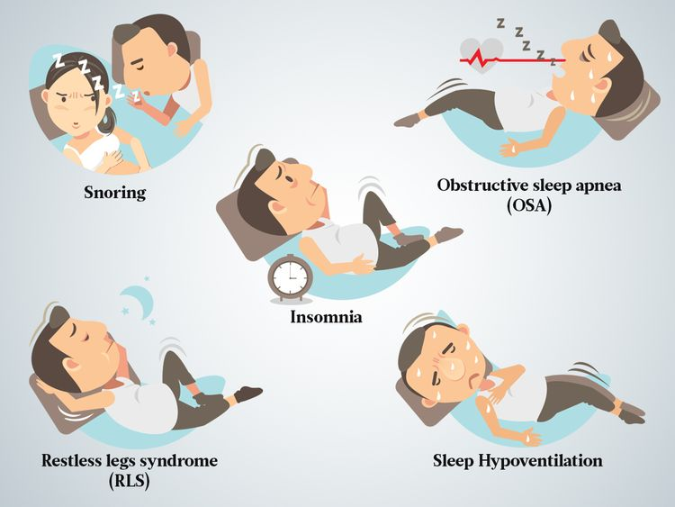

# Sleep And Healthstyle Analysis

## 📌 About the project
The primary goals of this Exploratory Data Analysis (EDA) are as follows:

1. Profile Analysis: Discern the profile of individuals affected by sleep disorders. Understanding the demographic and lifestyle characteristics of this group is crucial for developing targeted interventions and support.

2. Correlation with Health and Lifestyle Variables: This EDA aims to investigate how general sleep issues correlate with health and lifestyle variables present in the dataset. Identifying patterns and relationships between sleep disorders and other variables can provide valuable insights into potential influencing factors.

To achieve these objectives, an in-depth analysis of the majority of variables within the dataset was conducted. Through this comprehensive examination, we seek to draw conclusions and propose possible interventions for individuals experiencing sleep disorders.

📄 [Here you can check the entire analysis!](https://colab.research.google.com/drive/1Yx-TdR8yuOjdkJyfe8fhfJIB0vX6JHDD#scrollTo=yivRKyc77gEE)

## 📊 About the Data

The data was obtained through Kaggle, the largest website related to Machine Learning and Data Science.

You can check the source of the dataset through this link: https://www.kaggle.com/datasets/uom190346a/sleep-health-and-lifestyle-dataset

## 📊 Insights

- Certain professions suffer more from sleep disorders:
  A. The professions with the best combination of Sleep Duration and Quality are:
    - Managers
    - Engineers
    - Teachers
    - Salespeople
    - Scientists
   
   B. The professions with the worst combination of Sleep Duration and Quality  are:
    - Lawyers
    - Accountants
    - Nurses
    - Sales Representatives
    - Doctors

- We see different trends among age groups and genders;
  
- Individuals who sleep more and better tend to have lower stress levels.

